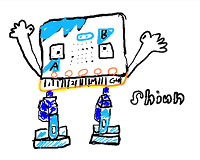
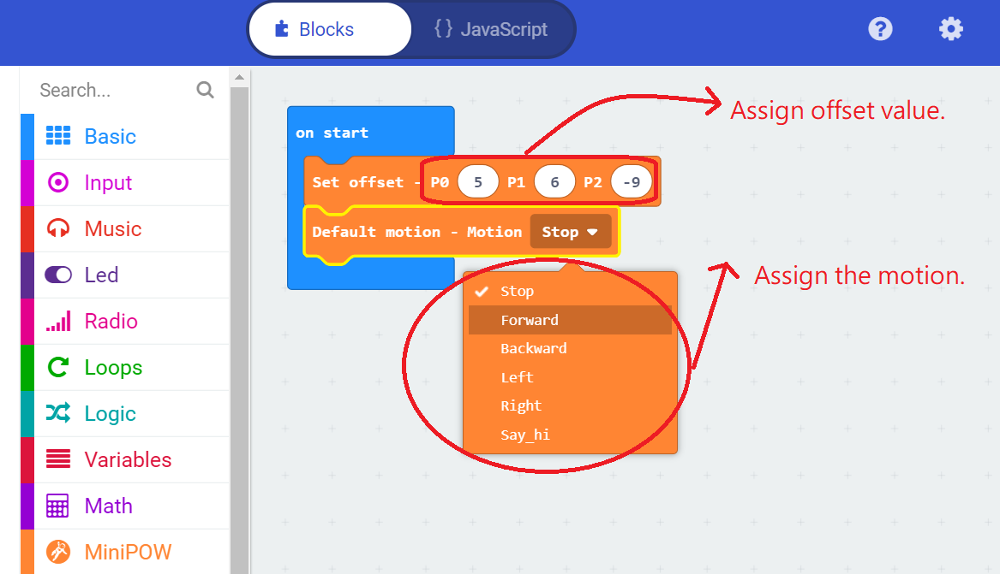

   
# Shiun Robot (Micro:bit Biped robot)
Using Micro:bit + MiniPlan MiniPOW board(Micro:bit power extension board) to control the Shiun Robot

MiniPlan : https://www.facebook.com/MiniPlanRobot/

This extension will provide the basic motion for user to control the robot. 

Basic motion : 

Forward / Backward / Turn Left / Turn Right / Stop

## Code Example 
1. Define the offset value for 4-servo motors.  (P0 / P1 /P2)
      
2. Assign the motion to the robot. 

Javascipt example code : 
==============================================================================
MiniPOW.set_offset(5, 6, -9)

MiniPOW.motion(MiniPOW.dnum.Stop)

basic.forever(function () {
	
})

## License

Non-Commercial license.

Author : Mason Chen
https://www.facebook.com/mason.chen.1420

## Supported targets

* for PXT/microbit
(The metadata above is needed for package search.)

